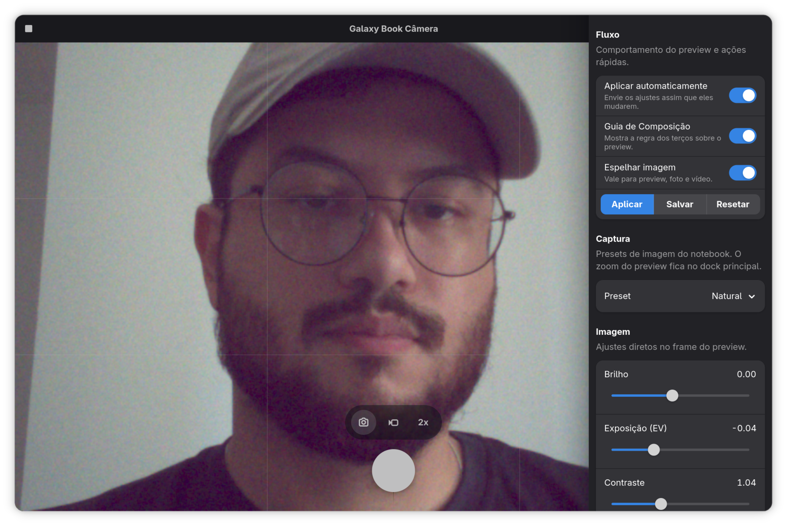

<p align="center">
  
</p>

<h1 align="center">Galaxy Book Camera</h1>

<p align="center">
  <a href="README.md">🇧🇷 Português</a> 
  <a href="README.en.md">🇺🇸 English</a> 
  <a href="README.es.md">🇪🇸 Español</a> 
  <a href="README.it.md">🇮🇹 Italiano</a>
</p>

## Quick install

To install the app from the public DNF repository:

```bash
sudo dnf config-manager addrepo --from-repofile=https://packages.caioregis.com/fedora/caioregis.repo
sudo dnf install galaxybook-camera akmod-galaxybook-ov02c10
```

If you also want the graphical installer and diagnostics helper:

```bash
sudo dnf install galaxybook-setup
```

`Galaxy Book Camera` is a Fedora camera app for Samsung Galaxy Book laptops,
currently focused on the **Galaxy Book4 Ultra**. It talks to `libcamera`
directly, uses native GNOME UI with `GTK4` and `libadwaita`, and is designed
to work with the packaged driver from
[`fedora-galaxy-book-ov02c10`](https://github.com/regiscaio/fedora-galaxy-book-ov02c10).

This repository only covers the **userspace side**: interface, still capture,
video recording, and image controls. The kernel module lives in a separate
repository.

## Current interface

### Main screen



### `About` modal


## Current status

As validated in April 2026, the app already covers the main camera workflow on
the Galaxy Book4 Ultra:

- direct preview through `libcamera`;
- photo and video capture with native GNOME UI;
- zoom exposed in the main dock;
- a dedicated `ov02c10` tuning file that reduces the fully `uncalibrated`
  `libcamera` fallback;
- integration with the packaged `ov02c10` driver and with `Galaxy Book Setup`.

The browser, Meet, Discord, Teams, and general WebRTC path still depends on
host setup, so that part remains documented and automated in `Galaxy Book Setup`.

On the current stack, the native Fedora/GNOME camera app can already work on
this laptop. Even so, the two paths do not produce the exact same visual result:

- the native Fedora app usually shows a more processed image, with more
  polished default color and white balance;
- `Galaxy Book Camera` uses a direct `libcamera` path that looks more raw and
  closer to the sensor, preserving more fine detail and exposing much more
  control over the image.

In practice, the native app may look better in default color, while
`Galaxy Book Camera` usually delivers better detail and more room for tuning.

## Why a dedicated app exists

The native GNOME camera app was an important UI and desktop integration
reference, but it does not solve the Galaxy Book4 Ultra case by itself.

On this hardware, the webcam depends on a more delicate combination of:

- an `ov02c10` driver outside the plain in-tree kernel path;
- the Intel IPU6 stack;
- `libcamera`;
- a browser and communications bridge when required.

In practice, the generic desktop path was not always the best place to validate
the sensor, preview, and hardware-specific tuning. `Galaxy Book Camera`
exists to:

- talk directly to `libcamera` in the main camera workflow;
- load sensor-specific `ov02c10` tuning;
- expose the controls that made sense for this hardware;
- prioritize detail and direct capture control instead of relying only on the
  generic desktop processing path;
- keep daily camera usage separate from repair, diagnostics, and browser bridge
  flows, which are handled by `Galaxy Book Setup`.

## Scope

This project provides:

- embedded preview in the main window;
- a main-dock zoom selector with `1x`, `2x`, `3x`, `5x`, and `10x`;
- still capture at the highest still resolution exposed by the camera;
- video recording with optional audio;
- a dedicated `ov02c10.yaml` tuning file for the direct `libcamera` path;
- `3s`, `5s`, and `10s` countdown support for photos and video start;
- persistent preferences for image and behavior;
- calibrated post-processing that reduces stronger green and blue casts in
  deep shadows and light extremes;
- a native `libadwaita` About dialog with links and a details page;
- desktop launcher integration, a dedicated icon, and a native GNOME window;
- controls for brightness, exposure, contrast, saturation, hue, temperature,
  tint, RGB, gamma, sharpening, and mirroring.

This project does **not** provide:

- the `ov02c10` kernel patch itself;
- a virtual webcam bridge for apps that strictly depend on V4L2;
- host-level fixes for `PipeWire` or `xdg-desktop-portal`.

## Runtime requirements

To run on this hardware, the system needs:

- `libcamera`;
- `GTK4` and `libadwaita`;
- Fedora `ffmpeg-free` or RPM Fusion `ffmpeg`;
- the packaged driver from `fedora-galaxy-book-ov02c10`.

In practice, the safest Fedora installation path is the `akmod` driver set:

- `galaxybook-ov02c10-kmod-common`
- `akmod-galaxybook-ov02c10`

## User installation

### Via the public DNF repository

The recommended end-user path is:

```bash
sudo dnf config-manager addrepo --from-repofile=https://packages.caioregis.com/fedora/caioregis.repo
sudo dnf install galaxybook-camera akmod-galaxybook-ov02c10
```

If you also want guided repair, diagnostics, and browser camera workflows:

```bash
sudo dnf install galaxybook-setup
```

### Via local RPMs

If the RPMs were built locally, install the driver packages first and the app
afterward:

```bash
sudo dnf install \
  /path/to/galaxybook-ov02c10-kmod-common-*.rpm \
  /path/to/akmod-galaxybook-ov02c10-*.rpm \
  /path/to/galaxybook-camera-*.rpm
sudo reboot
```

On the first boot after installation, `akmods` should build and install the
kernel module automatically. If Secure Boot is enabled, the system must already
be configured for `akmods` module signing. Otherwise the module may build but
still fail to load on boot.

If the camera still fails after reboot, the most useful checks are:

```bash
journalctl -b -u akmods --no-pager
modinfo -n ov02c10
journalctl -b -k | grep -i ov02c10
```

The expected result is the `ov02c10` module coming from the `akmods` output,
not from the in-tree kernel copy.

## Usage

After installation and reboot, the app can be opened from the GNOME menu. In a
`pt_BR` session it appears as **Galaxy Book Câmera**.

Current behavior:

- photos are saved to `XDG_PICTURES_DIR/Camera`;
- videos are saved to `XDG_VIDEOS_DIR/Camera`;
- the camera is opened directly through `libcamera`, without relying on Snapshot;
- the app injects its own `ov02c10` tuning file into the `libcamera` simple IPA;
- the `Natural` preset and the default baseline use a light calibration that
  moves color closer to the system webcam path without giving up direct
  `libcamera` detail;
- preview and capture post-processing neutralizes part of the stronger green
  and blue casts in deep shadows and difficult lighting;
- preview zoom uses an inline selector in the main dock.

## Known limitations

- This repository is focused on the GNOME-native camera app. Camera visibility
  in Snapshot, browsers, Meet, Teams, or Discord depends on the host stack
  (`PipeWire`, `WirePlumber`, `libcamera`, `xdg-desktop-portal`) and is not
  solved by this package alone. For that workflow, use `Galaxy Book Setup`.
- Support was primarily built and validated on the **Galaxy Book4 Ultra**.
  Other Galaxy Book models may still need additional driver, ACPI, or camera
  pipeline adjustments.

## Relationship with the driver and the community fix

The kernel module used by this app lives in:

- <https://github.com/regiscaio/fedora-galaxy-book-ov02c10>

That driver work builds on lessons from this community repository:

- <https://github.com/abdallah-alkanani/galaxybook3-ov02c10-fix/>

The current split between repositories keeps responsibilities clear:

- `fedora-galaxy-book-ov02c10`: kernel module and `akmod` packaging;
- `fedora-galaxy-book-camera`: GNOME app and userspace RPM packaging.

## Build and packaging

Build dependencies on Fedora:

```bash
sudo dnf install cargo rust pkgconf-pkg-config gtk4-devel libadwaita-devel libcamera-devel
```

If the host does not have the full toolchain, the `Makefile` uses a rootless
`podman` container.

Main commands:

```bash
make build
make test
make dist
make srpm
make rpm
```

The locally built binary is placed at:

```bash
./target/release/galaxybook-camera
```

To install the local development launcher:

```bash
make install-local
```

Relevant files:

- RPM spec: [`packaging/fedora/galaxybook-camera.spec`](packaging/fedora/galaxybook-camera.spec)
- launcher: [`data/com.caioregis.GalaxyBookCamera.desktop`](data/com.caioregis.GalaxyBookCamera.desktop)
- AppStream metadata: [`data/com.caioregis.GalaxyBookCamera.metainfo.xml`](data/com.caioregis.GalaxyBookCamera.metainfo.xml)

## License

This project is distributed under **GPL-3.0-only**. See [LICENSE](LICENSE).
